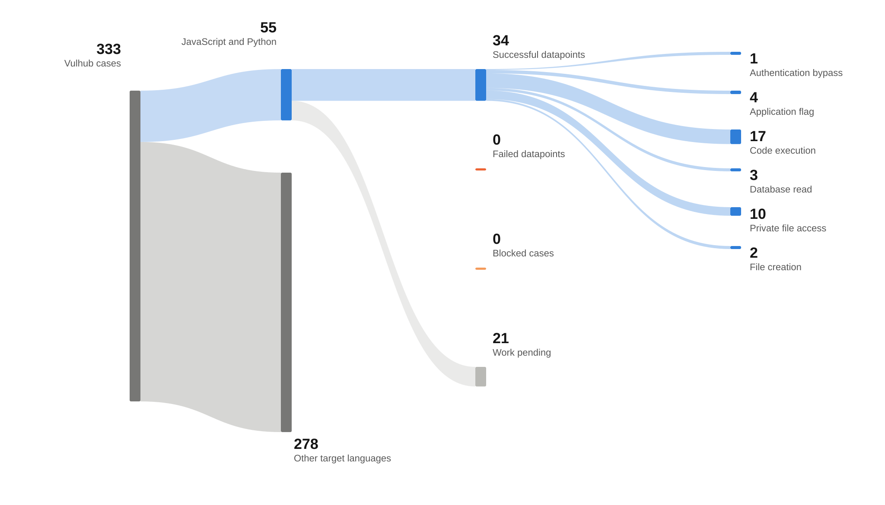

# Vulhub benchmark

This benchmark ports vulnerable JavaScript and Python applications from a pinned Vulhub revision.

## Source and selection

The source revision is [`8fd63916f7a8711e2e01dda0d27237e4d6175d38`](https://github.com/vulhub/vulhub/commit/8fd63916f7a8711e2e01dda0d27237e4d6175d38).
A case is one directory with a Docker Compose file at that revision.
The language decision uses the vulnerable application runtime and source code.
TypeScript source compiled to JavaScript counts when the deployed vulnerable runtime is JavaScript.
PoC scripts and container configuration do not determine the language.

## Version grouping

Each vulnerability keeps its own datapoint and source branch.
Cases in one application share the earliest version on which every grouped exploit was reproduced.
A version joins a group only after a live exploit test confirms it.

## Current status

The count data comes from the manager ledger and was generated at `2026-10-09T10:12:36.433550+00:00`.
The inventory has 333 cases.
Language selection keeps 55 candidates and excludes 278 cases.
There are 30 passing datapoints, 0 failed cases, and 0 blocked cases.
Another 3 cases are assigned and 22 await assignment.
Passing datapoints have 33 validated oracle occurrences.
The figure and [`counts.json`](counts.json) use these ledger totals.

## Failure categories

No cases have a confirmed failure or blocker yet.

## Published source branches

- [`aiohttp-001`](https://github.com/Jay-l-Break/dojo-vulhub/tree/aiohttp-001) at `21d7c493968e544088d61341dda072dc40932b31`
- [`airflow-001`](https://github.com/Jay-l-Break/dojo-vulhub/tree/airflow-001) at `e622fecd25edd57c6f94dbbeda0cd67f3ea247cb`
- [`airflow-002`](https://github.com/Jay-l-Break/dojo-vulhub/tree/airflow-002) at `b99690ae297308c75a6a92a70d21de1c97208193`
- [`comfyui-001`](https://github.com/Jay-l-Break/dojo-vulhub/tree/comfyui-001) at `c17383118477fefea9b675e97920027b56b2e3d6`
- [`comfyui-002`](https://github.com/Jay-l-Break/dojo-vulhub/tree/comfyui-002) at `aeaabf5c816082de61dacc5509d66dc0dab7be46`
- [`django-001`](https://github.com/Jay-l-Break/dojo-vulhub/tree/django-001) at `a73b108f3cc5fbb60e746979eeff076c1f061019`
- [`django-002`](https://github.com/Jay-l-Break/dojo-vulhub/tree/django-002) at `c49e3fce80761fa8f9dda289946f0e397563eb82`
- [`django-003`](https://github.com/Jay-l-Break/dojo-vulhub/tree/django-003) at `758859083b3f3d18d280d25c98a1515dd978b920`
- [`django-004`](https://github.com/Jay-l-Break/dojo-vulhub/tree/django-004) at `13c2c51377065a30e8a7f89f1b3e4b1c60383ba2`
- [`django-005`](https://github.com/Jay-l-Break/dojo-vulhub/tree/django-005) at `d2e9c84e7907ba048ddef39f31387825d2c800d4`
- [`django-006`](https://github.com/Jay-l-Break/dojo-vulhub/tree/django-006) at `45facb0cd2d5c3bf7bec88a2fb02bdeb878f620a`
- [`flask-001`](https://github.com/Jay-l-Break/dojo-vulhub/tree/flask-001) at `80302968d7aa25e2b051af1cbde1669ac0af64dd`
- [`gradio-001`](https://github.com/Jay-l-Break/dojo-vulhub/tree/gradio-001) at `8f689400725fbe6470c05d2e2ccd9a5b2398797d`
- [`gradio-002`](https://github.com/Jay-l-Break/dojo-vulhub/tree/gradio-002) at `feaf27cbb35995412b3294d2aedd35cff05d8ef3`
- [`langflow-001`](https://github.com/Jay-l-Break/dojo-vulhub/tree/langflow-001) at `66be9dd9cd9a93d26aaec19f0bd3d2d2e6d7c06a`
- [`langflow-002`](https://github.com/Jay-l-Break/dojo-vulhub/tree/langflow-002) at `3fd5e2791ca54f078ef220ab465093e35ba7cfbe`
- [`mongo-express-001`](https://github.com/Jay-l-Break/dojo-vulhub/tree/mongo-express-001) at `3a72f3f343e1725fb5bce524fbacf03b8d7d9c76`
- [`n8n-001`](https://github.com/Jay-l-Break/dojo-vulhub/tree/n8n-001) at `e008711653bffcebbcaa5d82e3bd95bc44d69f46`
- [`node-001`](https://github.com/Jay-l-Break/dojo-vulhub/tree/node-001) at `5d086b74e3f7b1b56823dbadc729fb0a852e6191`
- [`node-002`](https://github.com/Jay-l-Break/dojo-vulhub/tree/node-002) at `0128e84df40cf7fb22b329b1f605834a49d852bc`
- [`pgadmin-001`](https://github.com/Jay-l-Break/dojo-vulhub/tree/pgadmin-001) at `1c4944d9e8fbb9f1f3ba6f9e6fc116c1a7195168`
- [`pgadmin-002`](https://github.com/Jay-l-Break/dojo-vulhub/tree/pgadmin-002) at `aca8c5f899cfa944a3810dd6ee4c71c391724d8e`
- [`pgadmin-003`](https://github.com/Jay-l-Break/dojo-vulhub/tree/pgadmin-003) at `e02b428f9dcd23f81bcca5cd26f5353beb456732`
- [`pgadmin-004`](https://github.com/Jay-l-Break/dojo-vulhub/tree/pgadmin-004) at `bb916e41b93f2806323487310d0d0e11ae5c8d0e`
- [`vite-001`](https://github.com/Jay-l-Break/dojo-vulhub/tree/vite-001) at `7b19ef8805584acddf9ae935fc92483fbabf2baf`
- [`vite-002`](https://github.com/Jay-l-Break/dojo-vulhub/tree/vite-002) at `184c86cb41b787a698da3428560f9f618b860e0d`
- [`vite-003`](https://github.com/Jay-l-Break/dojo-vulhub/tree/vite-003) at `7fb4a5dcb5fe54893697c7873eaa6fb05d2a60b6`
- [`vite-004`](https://github.com/Jay-l-Break/dojo-vulhub/tree/vite-004) at `19f82efcdb68448f78d974aea100423bf1a538a2`
- [`yapi-001`](https://github.com/Jay-l-Break/dojo-vulhub/tree/yapi-001) at `e40ae35c2b89267b571a612e46f43705d0b6e0ab`
- [`yapi-002`](https://github.com/Jay-l-Break/dojo-vulhub/tree/yapi-002) at `77d51007d05ee99c041f2c2b038cbda195b2c98b`

## Validation

A datapoint passes only when a fresh deployment, its mapped PoC, and every claimed validation server oracle pass the programmatic checker.
Private flags, verifier settings, and deployment credentials stay outside source branches and this publication.
